# Docker与GitHub发布优化方案

生成日期：2026-06-07
目标：在 GitHub Actions 构建并发布 GHCR 镜像；生产更新保留宿主机 `.env` 和 `data/`；发布链路可回滚、可审计、可扫描。

## 当前发布流程

```mermaid
flowchart TD
  Push[push / PR / tag / workflow_dispatch] --> Verify[verify job]
  Verify --> Npm[npm audit/lint/typecheck/coverage]
  Verify --> SmokeBuild[docker build blog-navigation:smoke]
  SmokeBuild --> SmokeRun[docker run smoke]
  Verify --> BuildPush[build-and-push job]
  BuildPush --> Metadata[docker metadata-action]
  Metadata --> GHCR[docker/build-push-action -> GHCR]
  GHCR --> Deploy[manual deploy=true]
  Deploy --> SSH[SSH server]
  SSH --> Backup[tar .env data]
  Backup --> Pull[docker pull digest]
  Pull --> Compose[docker compose up]
  Compose --> Health[curl 首页]
  Health --> Rollback[失败尝试回滚镜像]
```



证据：

- workflow 名称：`.github/workflows/docker-deploy.yml:1`。
- 全局 cancel：`.github/workflows/docker-deploy.yml:20`。
- coverage：`.github/workflows/docker-deploy.yml:63`。
- smoke build：`.github/workflows/docker-deploy.yml:70`。
- smoke run：`.github/workflows/docker-deploy.yml:77`。
- build-push-action：`.github/workflows/docker-deploy.yml:182`。
- cache：`.github/workflows/docker-deploy.yml:189`。
- SBOM/provenance：`.github/workflows/docker-deploy.yml:192`。
- 更新前备份 `.env data`：`.github/workflows/docker-deploy.yml:312`。
- 生产 compose 数据挂载：`deploy/compose.prod.yaml:45`。

## 当前风险

### P1：测的不是发的

verify 用普通 `docker build`，push 用 build-push-action 重新构建。证据：`.github/workflows/docker-deploy.yml:70`、`.github/workflows/docker-deploy.yml:182`。

风险：smoke 通过的镜像不一定等于 GHCR 产物。

### P1：UI smoke 不跑最终镜像

UI smoke 使用源码启动本地服务，不是 GHCR 镜像。证据：`.github/workflows/ui-smoke.yml:88`、`.github/workflows/ui-smoke.yml:117`。

风险：standalone、entrypoint、权限、数据目录问题可能漏掉。

### P1：回滚 digest 不稳定

workflow 通过 inspect 当前容器推断上一个 digest，首次部署或旧容器不是 digest 时不可靠。证据：`.github/workflows/docker-deploy.yml:339`、`.github/workflows/docker-deploy.yml:369`。

### P1：生产 compose 可能漂移

部署段使用服务器现有 compose，不同步仓库内 `deploy/compose.prod.yaml`。证据：`.github/workflows/docker-deploy.yml:295`、`.github/workflows/docker-deploy.yml:359`。

### P2：缺镜像 CVE 阻断

当前只有 npm audit、SBOM/provenance，没有 Trivy/Grype 阻断。证据：`.github/workflows/docker-deploy.yml:50`、`.github/workflows/docker-deploy.yml:192`。

### P2：基础镜像浮动

`node:24-alpine` 未固定 digest。证据：`Dockerfile:1`、`Dockerfile:13`、`Dockerfile:33`。

### P2：健康检查探首页

Dockerfile healthcheck 探首页 SSR。证据：`Dockerfile:57`。

风险：首页渲染依赖数据和外部逻辑，不能作为轻量进程健康端点。

## GHCR 镜像标签策略

推荐 tags：

- `latest`：main 最新成功构建，只用于人工试用，不作为生产回滚依据。
- `main-<shortsha>`：main 每次构建。
- `sha-<shortsha>`：精确定位。
- `vX.Y.Z`：版本发布。
- `vX.Y`：可选稳定小版本线。
- `pr-<number>`：可选 PR 镜像，不部署生产。

生产部署：

- 只使用 digest：`ghcr.io/242282218/blog-nevigation@sha256:<digest>`。
- deploy summary 输出 digest。
- 服务器 `.last-good-digest` 保存上一次成功 digest。

参考：

- docker/metadata-action：https://github.com/docker/metadata-action/blob/master/README.md
- GitHub GHCR 发布文档：https://docs.github.com/en/actions/how-tos/use-cases-and-examples/publishing-packages/publishing-docker-images

## Dockerfile 优化

### 保留

- 多阶段构建。
- Next standalone。
- 非 root 运行。
- `BLOG_DATA_ROOT=/var/lib/blog-navigation`。
- 不把 `data/` 打进镜像。

证据：`Dockerfile:40`、`Dockerfile:50`。

### 调整

1. 固定基础镜像 digest。
2. 把 lint/typecheck 放 CI，Dockerfile 保留 build。
3. 使用 BuildKit npm cache mount。
4. 增加 `/api/health` 后，healthcheck 改探该端点。
5. 评估 entrypoint 每次递归 chown 的成本；数据量大后可改为首次部署预置属主。

参考：

- Vercel Next Docker：https://github.com/vercel/next.js/blob/canary/examples/with-docker/README.md
- Node Docker Alpine 说明：https://github.com/nodejs/docker-node/blob/main/README.md

## build cache

当前已有：

- `cache-from: type=gha`
- `cache-to: type=gha,mode=max`

证据：`.github/workflows/docker-deploy.yml:189`。

推荐：

- PR/branch：GHA cache。
- main/tag：GHA cache + registry cache。
- registry cache tag：`ghcr.io/242282218/blog-nevigation:buildcache`。
- 不把宿主机 `data/` 纳入任何镜像层和 cache。

参考：https://docs.docker.com/build/ci/github-actions/cache/

## smoke test

### 推荐 build once, test, push

流程：

1. `docker/setup-buildx-action`
2. `docker/build-push-action` with `load: true`, `tags: blog-navigation:ci-${sha}`
3. `docker run` with temp data volume
4. health check
5. UI smoke against container
6. Trivy scan same image
7. push GHCR tags/digest

参考 Docker test-before-push：https://docs.docker.com/build/ci/github-actions/test-before-push/

### Docker smoke 必须覆盖数据保留

命令要包含：

```bash
mkdir -p .tmp/docker-smoke-data
docker run -d \
  --name blog-navigation-smoke \
  -e EDITOR_ACCESS_TOKEN=ci-smoke-secret \
  -e COOKIE_SECURE=false \
  -e BLOG_DATA_ROOT=/var/lib/blog-navigation \
  -v "$PWD/.tmp/docker-smoke-data:/var/lib/blog-navigation" \
  -p 3210:3000 \
  blog-navigation:ci-${GITHUB_SHA}
```

断言：

- 容器能启动。
- health endpoint 通过。
- 数据目录可写。
- 重启容器后数据仍在。

## rollback

### 镜像回滚

流程：

1. 部署前读取服务器 `.last-good-digest`。
2. 新 digest 写入 `.candidate-digest`。
3. `DEPLOY_IMAGE=<new digest> docker compose up -d`。
4. health check 通过后，把 new digest 写入 `.last-good-digest`。
5. health check 失败时，用 old digest 重新 compose up。

注意：

- 镜像回滚不得恢复旧数据。
- `.env` 和 `data/` 保持原地。
- 回滚日志输出 old/new digest。

### 数据恢复

数据恢复是人工动作：

1. 停止容器。
2. 备份当前 `.env data`。
3. 从指定 `.tgz` 恢复。
4. 启动已知可用 digest。
5. 校验站点和后台。

不得在自动健康检查失败时覆盖 `data/`。

## release tag

发布策略：

- 合并 main：自动构建 `latest`、`main-<sha>`、`sha-<sha>`。
- 创建 `vX.Y.Z` tag：构建 semver tags 和 release notes。
- 人工部署：选择 digest，而不是 tag。

release summary：

- image digest。
- tags。
- SBOM/provenance 状态。
- Trivy 结果。
- smoke 结果。
- 数据保留检查结果。

## production deploy

部署前：

- 确认 `/opt/blog-nevigation/.env` 存在。
- 确认 `/opt/blog-nevigation/data` 存在。
- tar `.env data`。
- 校验仓库 `deploy/compose.prod.yaml` 与服务器 compose 一致，或安全同步 compose 文件。
- 不覆盖 `.env`。
- 不删除 `data/`。

部署中：

- 设置 `DEPLOY_IMAGE` 为 digest。
- `docker compose pull`。
- `docker compose up -d --force-recreate`。
- health check `/api/health`。

部署后：

- 写 `.last-good-digest`。
- 打印访问 URL。
- 打印数据目录。
- 打印备份包路径。

## 安全扫描

### Trivy

配置：

- `image-ref: blog-navigation:ci-${sha}` 或 GHCR digest。
- `severity: HIGH,CRITICAL`。
- `exit-code: 1`。
- `format: sarif`。
- 上传 Code Scanning。

参考：https://github.com/aquasecurity/trivy-action/blob/master/README.md

### GitHub attestations

当前已有 SBOM/provenance 基础，后续可增强 artifact attestation。

参考：https://docs.github.com/en/actions/security-for-github-actions/using-artifact-attestations/using-artifact-attestations-to-establish-provenance-for-builds

### Dependabot/Renovate

范围：

- npm dependencies。
- GitHub Actions。
- Docker base image digest。

## workflow 优化建议

### 新 job 拆分

- `quality`：npm audit、lint、typecheck、coverage。
- `docker-smoke`：build load、volume smoke、Trivy。
- `publish`：push GHCR。
- `deploy`：manual only，digest deploy。

### concurrency

- quality/publish 可以 cancel in progress。
- production deploy 不应 cancel in progress。

证据：当前全局 `cancel-in-progress: true` 在 `.github/workflows/docker-deploy.yml:20`。

### compose 同步

方案 A：部署前 scp 仓库 `deploy/compose.prod.yaml` 到服务器，保留服务器 `.env data`。

方案 B：部署前计算 sha256，如果不同则失败并提示人工同步。

推荐：先 B 后 A。先避免自动改生产 compose 造成意外。

## 验证清单

- `docker run` 含 `-v data:/var/lib/blog-navigation`。
- smoke 使用同一个 image tag。
- push summary 输出 digest。
- Trivy 阻断 HIGH/CRITICAL。
- deploy 使用 digest。
- `.last-good-digest` 写入。
- `.env data` 更新前 tar。
- health check 不探首页。
- 回滚不覆盖数据。
