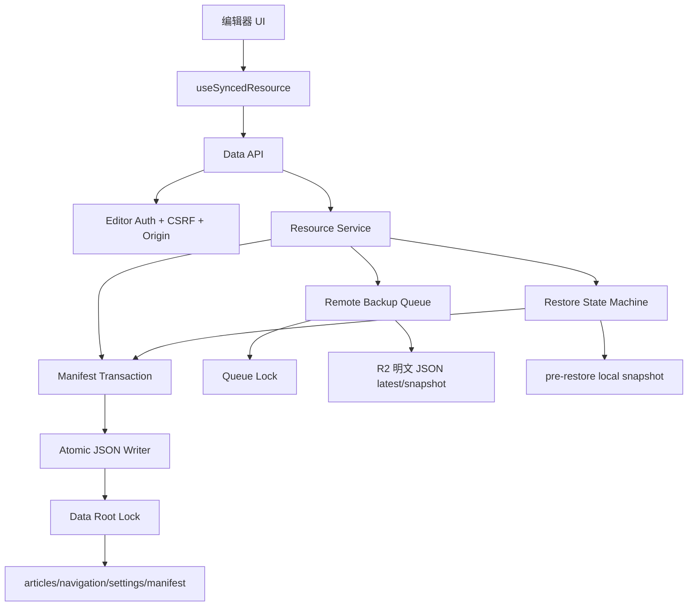

# 架构优化设计方案

生成日期：2026-06-07
目标：在不改变“自托管、运行时编辑、本地文件持久化、R2 明文备份、Docker 保留数据”的前提下，提高一致性、可恢复性、可扩展性和后续 coding agent 可实施性。

## 当前架构问题

### 1. 数据写入一致性不足

主数据和 manifest 双写不是事务。文章/导航/设置保存时，业务 JSON 写入和 manifest 更新分两步完成。证据：`src/lib/editor-data-storage.ts:893`、`src/lib/editor-data-storage.ts:897`、`src/lib/editor-data-storage.ts:1047`。一旦第二步失败，会出现“业务文件已变更，但 manifest 旧”的状态。

### 2. 备份队列语义不清

R2 pending 任务只记录 reason 和开关，不保存写入时 manifest/hash；drain 时读取当前数据。证据：`src/lib/backup-coordinator.ts:10`、`src/lib/editor-remote-backup.ts:128`、`src/lib/editor-remote-backup.ts:187`。这会让 snapshot 名称看似对应某次保存，内容却可能是之后的状态。

### 3. 配置流容易误解

`app-runtime.json` 里有 `dataRoot.pendingPath`，但真实运行数据根仍由 `BLOG_DATA_ROOT` 或默认路径决定。证据：`src/lib/app-runtime-config.ts:384`、`src/lib/runtime-config.ts:19`。用户可能误以为 UI 修改路径已经即时生效。

### 4. 存储层过于集中

`src/lib/editor-data-storage.ts` 同时处理路径、JSON、manifest、hash、锁、缓存、恢复。短期可维护，长期会让事务改造和分文件存储困难。

### 5. 单实例假设未显式化

当前 Docker 部署是单容器、宿主机 bind mount。文件锁和本地 JSON 不适合多副本同时写同一数据目录。lowdb 也明确提醒单文件 JSON 不适合 cluster；proper-lockfile 只能降低跨进程风险，不能解决多机器并发。

## 推荐目标架构

目标不是引入数据库，也不是改成 Git-backed CMS。目标是把当前文件型架构补齐为四层：

1. 资源服务层：文章、导航、设置各自定义 schema、校验、默认值、merge 策略。
2. 事务层：资源 JSON 和 manifest 作为同一 commit。
3. 写入层：temp + fsync + rename + 目录 fsync + 权限保留 + 临时文件清理。
4. 恢复/备份层：R2 明文 latest/snapshot、恢复前快照、manifest 前置条件、失败可观测。

## 模块边界

### `src/lib/data-root.ts`

职责：

- 解析 `BLOG_DATA_ROOT` 和默认路径。
- 暴露数据根路径、settings 路径、备份路径。
- 明确 `pendingPath` 不是即时生效路径。

迁移方式：从 `runtime-config.ts` 中提取路径职责，不改现有 API。

### `src/lib/atomic-json-writer.ts`

职责：

- 写 JSON 文件。
- 写临时文件。
- fsync 文件和目录。
- rename。
- 清理临时文件。
- 按绝对路径建立进程内队列。
- 保留原文件 mode/属主。

参考：`write-file-atomic` 的 per-file queue 和 fsync；lowdb/steno 的写队列。

### `src/lib/data-root-lock.ts`

职责：

- 包装当前 `editor-data-lock.ts`。
- 提供 `withDataRootLock(reason, fn)`。
- 用同一锁保护数据写入、manifest 事务、恢复、迁移。
- 新增 `withBackupQueueLock(fn)` 保护 `.backup-pending.json`。

参考：proper-lockfile 的 mkdir lock、stale、heartbeat。

### `src/lib/manifest-transaction.ts`

职责：

- 读取 current manifest。
- 生成 next manifest。
- stage 资源文件和 manifest。
- commit。
- rollback 或留下 marker。
- 启动时检测 marker 并恢复。

迁移方式：先只包裹现有 `saveArticles/saveNavigation/saveSettings`，不改变 API 返回。

### `src/lib/resource-schema/*`

职责：

- `article.schema.ts`：slug、status、frontmatter、sourceLinks、revision notes。
- `navigation.schema.ts`：category、tool、URL、排序。
- `settings.schema.ts`：site、R2 状态显示用字段。

参考：Tina schema、Outstatic Zod schema、Pages CMS field registry，但只做固定 schema，不做通用 CMS 配置系统。

### `src/lib/remote-backup-queue.ts`

职责：

- `latest` 任务合并去重。
- `snapshot` 任务绑定 manifest/hash。
- 保留 failed 状态。
- 设置页可读取队列状态。
- 手动重试。

迁移方式：兼容读取当前 `.backup-pending.json`，新增 `version` 字段。

### `src/lib/restore-state-machine.ts`

职责：

- 恢复前写本地 snapshot。
- 写 restore marker。
- 校验 payload manifest/schemaVersion/hash。
- stage 目标数据。
- commit。
- 恢复失败后保留 marker 和错误详情。

## 数据流

### 公开读取

1. `src/app/page.tsx`、文章详情、导航页调用内容读取层。
2. 内容读取层优先读运行时 JSON。
3. 读取失败时仅允许回退 seed markdown，不允许吞掉运行时数据损坏。
4. 读到 manifest/schemaVersion 不匹配时，返回可诊断错误或触发只读迁移检查。

### 编辑器保存

1. UI 通过 GET 获取资源和 revision/hash。
2. 用户修改进入本地状态和 localStorage 草稿。
3. PUT 提交资源、expected revision/hash。
4. API 鉴权、CSRF、origin 校验。
5. Resource schema 校验。
6. Manifest transaction stage 资源和 manifest。
7. commit 成功。
8. 入队 R2 明文 latest；如果启用 snapshot，绑定当前 manifest/hash。
9. 返回新 revision/hash 和 remote backup queue 状态。

### R2 明文备份

1. payload 包含 `schemaVersion`、`manifest`、`articles`、`navigation`、`settings`、`createdAt`、`sourceVersion`。
2. `latest/backup.json` 覆盖写。
3. `snapshots/<timestamp>-<reason>-<manifestHash>.json` 写一次。
4. 上传体必须是可读 JSON。
5. 不增加口令字段。

### 恢复

1. 读取远端或本地 backup payload。
2. 校验 JSON、schemaVersion、manifest、resource hash。
3. 写 `pre-restore` 本地 snapshot。
4. 写 restore marker。
5. stage 新数据。
6. commit。
7. 重新读取校验。
8. 入队 R2 latest 同步。
9. 返回恢复结果和远端同步状态。

## 配置流

当前问题：`pendingPath` 容易让用户误判。推荐：

- 设置页显示“当前生效数据目录”：来自 `BLOG_DATA_ROOT` 或默认值。
- 设置页显示“待切换数据目录”：来自 `app-runtime.json`。
- 文案明确：切换数据目录需要更新部署环境变量并重启；不会自动搬迁原数据。
- Docker 文档继续固定 `/opt/blog-nevigation/data:/var/lib/blog-navigation`。

证据：`src/lib/app-runtime-config.ts:351`、`src/lib/app-runtime-config.ts:384`、`src/lib/runtime-config.ts:19`、`compose.yaml:23`。

## API 边界

保留当前 REST API，不引入 GraphQL。

推荐 API：

- `GET /api/data/articles`：返回资源、revision/hash、schemaVersion。
- `PUT /api/data/articles`：整包保存，后续可增 PATCH。
- `GET /api/data/backup/remote/status`：包含 R2 配置状态、latest、snapshot、queue failed。
- `POST /api/data/backup/remote/retry`：手动重试 failed。
- `GET /api/data/health` 或 `/api/health`：用于 Docker healthcheck，不读首页 SSR。

不建议短期引入：

- GitHub App 主存储。
- Sanity/Contentful。
- Tina GraphQL。
- 多用户 OAuth。
- 通用 YAML CMS 配置系统。

## 渐进式迁移方案

### 阶段 0：规则固化

目标：防止回归。

- 保留 AGENTS 规则。
- 架构测试继续断言 R2 明文、Docker bind mount、README 数据保留。
- 新增文档索引指向本方案。

验证：`npm run test:architecture`。

### 阶段 1：备份队列可观测

目标：不丢 pending 失败。

- `.backup-pending.json` 增加 version。
- 失败任务保留 failed 状态。
- 设置页展示失败原因和手动重试。
- latest 去重，snapshot 绑定 manifest/hash。

验证：`tests/lib/backup-coordinator.test.ts`、`tests/app/remote-backup-route.test.ts`。

### 阶段 2：manifest 事务

目标：资源文件和 manifest 一致。

- 增加 `manifest-transaction.ts`。
- 保存 articles/navigation/settings 全部走事务。
- 启动时检测事务 marker。

验证：模拟 manifest 写失败，断言数据不半提交或 marker 可恢复。

### 阶段 3：schemaVersion 与迁移

目标：后续拆分数据文件有路径。

- manifest 增加 `schemaVersion`。
- backup payload 增加 schemaVersion。
- 增加迁移 registry。
- 启动只做检查，不自动危险迁移。

验证：旧数据读取、新数据写入、备份恢复跨版本测试。

### 阶段 4：资源拆分

目标：降低整包写入和 R2 payload 压力。

- 文章从单 `articles.json` 演进为 `articles/index.json + articles/by-slug/*.json`。
- 保留导入导出兼容。
- R2 latest payload 可继续聚合为明文 JSON，也可增加分片 manifest。

验证：大文章集性能、恢复、导入导出、R2 payload 大小阈值。

## 不建议照搬的模式

- 不照搬 Outstatic/Tina/Pages CMS 的 GitHub 主存储，因为当前 Docker 数据目录和 R2 明文备份是核心约束。
- 不照搬 Decap 的 Git PR/label workflow，因为会和运行时本地 JSON 保存冲突。
- 不引入 PostgreSQL，只为个人站增加数据库成本不划算。
- 不引入 MDX 任意组件执行，当前 sanitize Markdown 更安全。

## 实施检查清单

- 改 R2：必须确认上传体仍是明文 JSON。
- 改 Docker：必须确认 `.env` 和 `data/` 只备份保留，不删除不覆盖。
- 改存储：必须补失败注入测试。
- 改恢复：必须补恢复前快照和 manifest 校验测试。
- 改 UI：必须补 aria/focus/loading 测试或 smoke。
