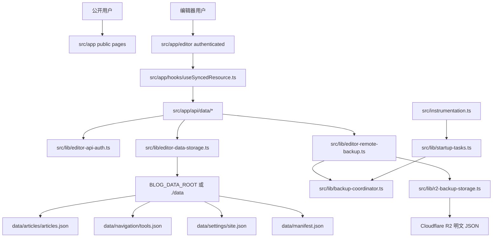

# 项目全量审查报告

生成日期：2026-06-07
范围：架构、代码、数据安全、R2 明文备份、Docker/GitHub Actions、测试、前端 UX、文档。

## 总体结论

当前项目是单实例状态型 Web 应用：Next.js App Router 提供公开页、编辑器页和 API；运行时数据落在 `BLOG_DATA_ROOT` 指向的数据目录；文章、导航、设置以 JSON 文件持久化；编辑器通过 revision/hash 做乐观并发控制；R2 远端备份是明文 JSON；Docker 通过宿主机 bind mount 保留 `.env` 和 `data/`。

主链路已经有不少正确基础：数据写锁、临时文件替换、manifest、恢复前快照、R2 明文备份、启动 drain、每 3 小时定时备份、Docker 宿主机数据挂载、GitHub Actions 发布 GHCR 镜像。最大短板不是“缺功能”，而是几个工程链路还没闭环：数据文件与 manifest 双写非事务、R2 pending 失败后可观测性不足、Docker 发布 smoke 与最终镜像不一致、回滚只回镜像不回数据、前端可访问性和对比度有具体问题。

## 成功标准

- R2 远端备份继续保持明文 JSON，可直接下载检查和恢复。
- Docker 更新必须保留生产 `.env` 和宿主机 `data/`，更新前必须快照 `.env data`。
- 发布链路要做到“测试的镜像就是发布的镜像”。
- 数据恢复要有恢复前快照、manifest 校验、失败可回滚或可诊断状态。
- 后台表单、loading、focus、对比度达到可访问性基本线。

## P0 问题

### P0-1：不能重新引入口令式 R2 备份

项目规则已经明确 R2 远端备份必须是明文 JSON，不能重新增加历史口令类字段、UI 输入框、API 字段或文档引导。证据：`AGENTS.md:5`、`AGENTS.md:7`、`AGENTS.md:22`、`AGENTS.md:23`。当前实现方向正确：R2 上传直接 `JSON.stringify`，下载后直接 `JSON.parse`，证据：`src/lib/r2-backup-storage.ts:476`、`src/lib/r2-backup-storage.ts:483`；README 也写明 R2 备份是明文 JSON，证据：`README.md:259`。

行动：所有后续编码任务都必须把“R2 明文备份”作为架构不变量；任何涉及 R2 的测试都要覆盖“历史口令类字段不保存、上传体是可读 JSON、下载后可直接恢复”。

### P0-2：Docker 更新必须保留 `.env` 和 `data/`

项目规则要求更新镜像或容器时不得删除、重建或覆盖生产数据目录和生产 `.env`，更新前必须做本地快照。证据：`AGENTS.md:13`、`AGENTS.md:14`、`AGENTS.md:15`、`AGENTS.md:17`。当前 README、compose、部署脚本已体现这一点：`compose.yaml:23`、`deploy/compose.prod.yaml:45`、`README.md:187`、`README.md:218`、`README.md:239`、`deploy/git-deploy.sh:115`。

行动：Docker 发布优化只能替换镜像和 compose 配置，不能自动清空或重建宿主机数据。数据回滚必须是显式人工命令，不能在健康检查失败时自动覆盖现有数据。

## P1 问题

### P1-1：数据文件与 manifest 双写不是事务

文章、导航、设置写入会先写业务 JSON，再更新 manifest；如果 manifest 写失败，客户端可能得到失败响应，但业务文件已经变化。证据：`src/lib/editor-data-storage.ts:893`、`src/lib/editor-data-storage.ts:897`、`src/lib/editor-data-storage.ts:1047`。这会导致 manifest 与真实数据短期不一致，影响恢复前置条件、hash 校验和并发控制。

行动：把资源 JSON 与 manifest 写入合并到同一 stage/commit 状态机：先写 `*.next` 和 `manifest.next`，fsync 后 rename，失败时留下可恢复 marker。

### P1-2：R2 pending 任务不是写入时快照

pending 队列只记录 reason 和 snapshot 开关，真正 drain 时才读取当前数据。延迟 drain 后，snapshot 可能不是触发那次保存时的数据。证据：`src/lib/backup-coordinator.ts:10`、`src/lib/editor-remote-backup.ts:128`、`src/lib/editor-remote-backup.ts:187`。

行动：将 R2 队列拆成两类：`latest` 允许合并去重；`snapshot` 必须绑定入队时 manifest/hash 或 payload 摘要。

### P1-3：R2 pending 失败 3 次后静默丢弃

当前队列失败到上限会移除任务，远端备份可能永久落后，而且设置页没有明确展示失败任务。证据：`src/lib/backup-coordinator.ts:8`、`src/lib/backup-coordinator.ts:238`。

行动：失败任务保留为 `failed` 状态，设置页显示最后失败原因、失败次数、下次重试时间，并提供手动重试。

### P1-4：Docker 发布测试镜像与推送镜像不一致

`verify` job 里用 `docker build --tag blog-navigation:smoke .` 测试，`build-and-push` 又用 `docker/build-push-action` 重新构建并推送，存在“测的不是发的”。证据：`.github/workflows/docker-deploy.yml:70`、`.github/workflows/docker-deploy.yml:182`。UI smoke 跑源码启动服务，不跑 GHCR 最终镜像，证据：`.github/workflows/ui-smoke.yml:88`、`.github/workflows/ui-smoke.yml:117`。

行动：改为 Buildx `load: true` 构建同源测试镜像，Docker smoke、Trivy 扫描通过后，再用同一构建缓存推 GHCR。

### P1-5：生产回滚目标不可靠

GitHub Actions 回滚依赖 `docker inspect` 推断当前容器 digest；首次部署、旧容器不是 digest、repo digest 缺失时会失效。证据：`.github/workflows/docker-deploy.yml:339`、`.github/workflows/docker-deploy.yml:369`。`deploy/git-deploy.sh` 也可能记录可变 tag 而不是不可变 digest，证据：`deploy/git-deploy.sh:197`、`deploy/git-deploy.sh:211`。

行动：部署成功后写服务器 `.last-good-digest`，下一次部署前读取它作为明确回滚目标。生产启动统一使用 `ghcr.io/...@sha256:<digest>`。

### P1-6：前端关键对比度和错误语义不达标

warning badge 使用浅底和偏亮文本，对比度不足。证据：`tailwind.config.ts:58`、`src/app/editor/(authenticated)/blog/new/ArticleEditorPanels.tsx:141`、`src/app/editor/(authenticated)/blog/new/NewArticleContent.tsx:751`。代码块复制按钮 hover 颜色组合对比度很低，证据：`src/app/styles/markdown-preview.css:194`、`src/app/styles/design-tokens.css:95`。运行时配置表单错误只在顶部提示，没有给确认输入框稳定 `aria-invalid`/`aria-describedby` 和错误聚焦，证据：`src/app/editor/(authenticated)/settings/runtime/page.tsx:214`、`src/app/editor/(authenticated)/settings/runtime/page.tsx:60`。

行动：先修 token 对比度，再统一表单字段错误组件。

## P2 问题

- 配置类文件弱于主数据：R2 配置、运行时配置使用 temp+rename，但没有 fsync，也不走统一数据写锁。证据：`src/lib/r2-backup-storage.ts:143`、`src/lib/r2-backup-storage.ts:148`、`src/lib/app-runtime-config.ts:275`。
- 脚本导入恢复弱于应用内恢复，没有应用内 `.restore-state.json` 状态机和 fsync。证据：`scripts/data/runtime-data.mjs:414`、`scripts/data/runtime-data.mjs:494`、`scripts/data/runtime-data.mjs:518`。
- Docker workflow 缺少镜像 CVE 阻断；当前有 npm audit、SBOM/provenance，但没有 Trivy/Grype。证据：`.github/workflows/docker-deploy.yml:50`、`.github/workflows/docker-deploy.yml:192`。
- workflow 全局 `cancel-in-progress: true` 可能中断同 ref 的生产部署。证据：`.github/workflows/docker-deploy.yml:20`。
- 基础镜像使用浮动 tag，构建不可完全复现。证据：`Dockerfile:1`、`Dockerfile:13`、`Dockerfile:33`。
- loading 状态缺少 `role="status"`/`aria-live`。证据：`src/app/loading.tsx:3`、`src/app/editor/(authenticated)/settings/runtime/page.tsx:305`、`src/app/editor/(authenticated)/blog/new/NewArticleContent.tsx:529`。
- 编辑器预览目录缺少可访问命名和 focus 样式。证据：`src/app/editor/(authenticated)/blog/components/PreviewPane.tsx:103`。
- R2 同步/恢复共用 `isRemoteBusy`，按钮文案不反映具体操作。证据：`src/app/editor/(authenticated)/settings/CloudflareR2SettingsPanel.tsx:256`、`src/app/editor/(authenticated)/settings/CloudflareR2SettingsPanel.tsx:459`。

## P3 问题

- 编辑器视图切换按钮有 `aria-pressed`，父容器缺少 group 语义。证据：`src/app/editor/(authenticated)/blog/new/ArticleEditorPanels.tsx:50`。
- 博客详情和预览内长 URL、长英文标题、revision note 可能移动端溢出。证据：`src/app/posts/[...slug]/page.tsx:154`、`src/app/editor/(authenticated)/blog/components/PreviewPane.tsx:133`。
- README 的 `latest` 更新脚本保留了 `.env data`，但缺少健康检查和自动镜像回滚。证据：`README.md:187`、`README.md:218`、`README.md:232`。

## 当前项目架构说明

核心边界：

- `src/app`：页面和 API 边界，编辑器 API 负责鉴权、校验、revision 冲突和备份入队。
- `src/lib/editor-data-storage.ts`：运行时数据核心层，管理数据 JSON、manifest、hash、写锁、恢复。
- `src/lib/editor-data-lock.ts`：用目录锁做跨请求写入互斥。证据：`src/lib/editor-data-lock.ts:199`。
- `src/lib/r2-backup-storage.ts`：R2 配置、明文 JSON 上传和下载。
- `src/lib/backup-coordinator.ts`：pending 队列、重试和 drain。
- `src/lib/startup-tasks.ts`：启动 drain 和每 3 小时定时备份。证据：`src/lib/startup-tasks.ts:27`。
- `Dockerfile`、`compose.yaml`、`deploy/compose.prod.yaml`、`.github/workflows/docker-deploy.yml`：镜像构建、数据挂载和发布。

## 代码质量问题

- 存储层职责较集中，既处理文件路径、JSON parse/stringify、manifest、revision、恢复，也承担缓存策略。短期可接受，后续应提取 `atomic-json-writer`、`manifest-transaction`、`restore-state` 三个小模块。
- 文章、导航、设置保存是整包 PUT，文章量增长后 API body、hash 计算、R2 backup payload 都会放大。可先加 payload 大小告警，再逐步拆 `articles/index.json + articles/by-slug/*.json`。
- `app-runtime.json` 的 `pendingPath` 只是表达重启后待处理，真实读写仍由 `BLOG_DATA_ROOT` 或默认路径决定。证据：`src/lib/app-runtime-config.ts:384`、`src/lib/runtime-config.ts:19`。设置页和文档要明确“不会自动迁移数据目录”。

## 安全问题

- 编辑器认证仍是口令/secret 模型，适合单用户，但没有功能级权限。证据：`src/lib/editor-auth-runtime.ts:22`、`src/lib/editor-auth-runtime.ts:260`。
- 供应链扫描缺口集中在镜像层和依赖升级自动化，不在 R2 备份。应加 Trivy、Dependabot/Renovate、CodeQL。
- 不建议引入 GitHub App、多用户协作者、OAuth 作为近期目标；它们会扩大攻击面和配置成本。

## 数据安全问题

最高优先级是事务一致性和可观测性：manifest 双写非事务、pending 失败丢弃、snapshot 语义不精确、配置文件 fsync 不一致、数据回滚和镜像回滚没有清晰分离。

R2 策略必须保持明文 JSON；优化方向是校验、大小阈值、失败状态、snapshot 保留策略和恢复演练，而不是增加口令。

## 测试问题

现有测试规模较好：`tests` 下约 49 个文件、约 366 个用例；coverage 快照约 statements 66.96%、functions 67.29%、branches 59.30%。R2 明文、防旧字段、远端恢复、运行时数据迁移覆盖较扎实。

缺口：

- Docker 更新保 `.env data` 主要靠静态断言，缺少 fake docker/git/tar 的行为级测试。证据：`tests/architecture/repository-structure.test.ts:173`、`tests/architecture/repository-structure.test.ts:205`。
- Docker smoke 没挂载真实数据目录。证据：`.github/workflows/docker-deploy.yml:77`。
- R2 与 Cloudflare/S3 集成全是 mock，无法发现真实 Body 类型和 403/404 差异。
- UI smoke 关键列表路径部分用 route fulfill 和 localStorage，降低了服务端持久化合同覆盖。证据：`scripts/test/verify-editor-blog-ui.py:101`、`scripts/test/verify-editor-blog-ui.py:319`。

## CI/CD 问题

发布链路目前有基础质量门禁和 GHCR 推送，但成熟度还不够：同源镜像 smoke、Trivy、digest 部署、last-good-digest、生产 deploy 单独 concurrency、compose 同步/校验、health endpoint 都应补齐。

## UX 问题

主要不是页面大改，而是后台可用性细节：对比度、字段错误、loading 语义、可见焦点、R2 忙碌态、预览目录、长文本溢出。后台编辑体验后续可借鉴 Outstatic 的发布侧栏、Decap 的工作流视图、Pages CMS 的表单可访问性组件。

## 证据索引

| 主题 | 证据 |
|---|---|
| 技术栈 | `package.json:44`、`package.json:45`、`package.json:46` |
| 数据根 | `src/lib/runtime-config.ts:19`、`Dockerfile:40`、`compose.yaml:10` |
| 数据挂载 | `compose.yaml:23`、`deploy/compose.prod.yaml:45`、`README.md:239` |
| 更新前快照 | `README.md:218`、`deploy/git-deploy.sh:115`、`.github/workflows/docker-deploy.yml:312` |
| R2 明文 | `src/lib/r2-backup-storage.ts:476`、`src/lib/r2-backup-storage.ts:483`、`README.md:259` |
| 3 小时备份 | `src/lib/startup-tasks.ts:27`、`src/lib/startup-tasks.ts:44` |
| revision 冲突 | `src/app/api/data/articles/route.ts:96`、`src/app/hooks/useSyncedResource.ts:172` |
| manifest 风险 | `src/lib/editor-data-storage.ts:893`、`src/lib/editor-data-storage.ts:897` |
| Docker 重复构建 | `.github/workflows/docker-deploy.yml:70`、`.github/workflows/docker-deploy.yml:182` |
| Docker 回滚 | `.github/workflows/docker-deploy.yml:339`、`.github/workflows/docker-deploy.yml:369` |
| UX 对比度 | `tailwind.config.ts:58`、`src/app/styles/markdown-preview.css:194` |
| 测试脚本 | `package.json:27`、`vitest.config.ts:17` |

## 2026-06-08 多 Agent 深度审查增补

本节是后续 Codex 执行优化时的最新依据。前述历史结论仍有效；如出现冲突，以本节的约束和优先级为准。

### 已完成的分工审查

| Agent | 范围 | 关键结论 |
|---|---|---|
| Agent A 架构 | `src/app`、`src/lib`、数据流、配置流、备份流 | 当前是单实例 Next.js 状态型应用；`editor-data-storage` 过于集中；R2 队列缺跨进程锁；运行时数据根配置语义需要澄清。 |
| Agent B UX | 公开页、后台、编辑器、设置页、设计 token、移动端 | 信息截断过多；恢复操作依赖 `window.confirm`；R2 设置页过长；`text-subtle` 等对比度不足；局部 loading 缺可读状态。 |
| Agent C 数据安全 | 本地存储、manifest、R2、恢复、队列 | R2 明文链路正确；`latest` 覆盖和默认 snapshot 策略有风险；本地恢复前缺持久化快照；队列损坏缺隔离重建。 |
| Agent D Docker/CI | Dockerfile、compose、GHCR、Trivy、部署、回滚 | 基础镜像浮动；Trivy 扫 smoke image 而非最终 digest；workflow 与 `deploy/git-deploy.sh` 有漂移；回滚只回镜像。 |
| Agent E 测试 | Vitest、architecture、smoke、coverage | 测试体系较完整，但 runtime 设置页、favicon/og/sitemap/robots、`api-json-body`、目录/阅读进度组件缺覆盖。 |
| Agent F 博客参考 | Next.js/Markdown/MDX 博客 | `timlrx` 的内容 schema、TOC、SEO 派生字段值得借鉴；纯 build-time Contentlayer 不适合直接替代运行时编辑。 |
| Agent G CMS 参考 | Tina、Payload、Pages CMS、Outstatic | 适合借鉴最小草稿/发布双轨、schema 到 Zod 到表单、轻量编辑锁；不适合引入大型 CMS 平台化能力。 |
| Agent H 文件持久化 | Pages CMS、Tina、Decap | 适合借鉴 sha 冲突、schema lock、metadata/迁移链；不适合 GitHub App、GraphQL datalayer、多 backend。 |
| Agent I 发布体系 | Next Docker、Docmost、Payload、Starlight、Trivy | 发布应扫描最终 digest、上传 SARIF、固定基础镜像版本；多架构和大型矩阵暂不照搬。 |
| Agent J 文档体系 | Starlight、Payload、Directus、博客模板 | 当前审查材料多，但读者路径不稳定；应拆成入门、使用、运维、开发、架构、设计系统。 |

### 最新严重级结论

#### P0：R2 自动备份必须继续保持明文 JSON

当前规则和实现方向正确：项目规则写明 R2 远端备份必须是明文 JSON，且不为 R2 自动链路新增远端口令字段。证据：`AGENTS.md:5`、`AGENTS.md:6`、`AGENTS.md:8`、`src/lib/r2-backup-storage.ts:492`、`src/lib/r2-backup-storage.ts:500`、`tests/lib/r2-backup-storage.test.ts:436`。后续所有 R2 相关优化必须以“上传体可直接 `JSON.parse`、下载后可直接恢复”为验收条件。

#### P0：Docker 更新不得破坏 `.env` 与 `data/`

当前 compose 和部署脚本保留宿主机数据目录，方向正确。证据：`compose.yaml:10`、`compose.yaml:24`、`deploy/compose.prod.yaml:26`、`deploy/compose.prod.yaml:45`、`deploy/git-deploy.sh:105`、`deploy/git-deploy.sh:116`、`.github/workflows/docker-deploy.yml:374`。后续若同步 `compose.prod.yaml`，只能同步 compose 文件本身，不得覆盖服务器 `.env` 和 `data/`。

#### P1：备份队列和恢复状态要从“可用”提升到“可诊断、可恢复”

当前 R2 禁用时 `queueCurrentBackupToRemote` 直接返回 disabled，业务写入仍会提交；队列 `.backup-pending.json` 缺跨进程锁；解析失败会抛错但不隔离损坏文件。证据：`src/lib/editor-remote-backup.ts:98`、`src/lib/backup-coordinator.ts:159`、`src/lib/backup-coordinator.ts:166`、`src/lib/backup-coordinator.ts:339`、`src/lib/editor-data-lock.ts:199`。应补：队列文件锁、损坏隔离为 `.corrupt-*`、failed 状态保留、设置页高危状态提示。

#### P1：发布链路应扫描最终 GHCR digest

当前 Trivy 只扫描 smoke image，最终 GHCR 镜像由后续 job 重新构建。证据：`.github/workflows/docker-deploy.yml:69`、`.github/workflows/docker-deploy.yml:136`、`.github/workflows/docker-deploy.yml:249`、`.github/workflows/docker-deploy.yml:263`。应改为扫描最终 digest，或至少把同一 Buildx 缓存/产物贯穿 smoke、scan、push。

#### P1：后台关键 UX 要先修可访问性与危险操作确认

`text-subtle` 在浅色背景对比度不足，恢复操作依赖浏览器 confirm，R2 设置过长且关键信息容易漏扫。证据：`src/app/styles/design-tokens.css:73`、`src/app/styles/design-tokens.css:80`、`src/app/editor/(authenticated)/page.tsx:153`、`src/app/editor/(authenticated)/page.tsx:195`、`src/app/editor/(authenticated)/settings/CloudflareR2SettingsPanel.tsx:471`、`src/app/editor/(authenticated)/settings/CloudflareR2SettingsPanel.tsx:556`。应先修 token、loading 语义、恢复确认 modal，再做大 UI 优化。

### 当前项目优势

- 数据写入已有原子 JSON 写基础、manifest transaction、跨进程数据锁，证据：`src/lib/atomic-json-writer.ts:30`、`src/lib/manifest-transaction.ts:122`、`src/lib/editor-data-lock.ts:199`。
- 编辑 API 已有 session、CSRF、origin、revision 冲突保护，证据：`src/app/api/data/articles/route.ts:58`、`src/app/api/data/articles/route.ts:117`、`src/app/hooks/useSyncedResource.ts:156`。
- Docker 已使用 bind mount 持久化数据，CI 已有 Docker smoke、Trivy、digest 部署基础，证据：`deploy/compose.prod.yaml:45`、`.github/workflows/docker-deploy.yml:81`、`.github/workflows/docker-deploy.yml:136`、`.github/workflows/docker-deploy.yml:350`。
- 测试体系覆盖了鉴权、CSRF、数据 API、R2 明文、远端恢复、UI smoke 和架构规则，证据：`tests/app/editor-auth.test.ts:133`、`tests/app/editor-data-routes.test.ts:96`、`tests/lib/r2-backup-storage.test.ts:436`、`tests/app/remote-backup-route.test.ts:130`、`tests/architecture/repository-structure.test.ts:183`。

### 当前项目短板

- 文件存储层职责集中在 `src/lib/editor-data-storage.ts`，长期会阻碍事务化和资源拆分，证据：`src/lib/editor-data-storage.ts:43`、`src/lib/editor-data-storage.ts:839`、`src/lib/editor-data-storage.ts:1148`。
- 本地导入恢复缺持久化 pre-local-restore 快照，证据：`src/app/api/data/backup/route.ts:96`、`src/app/api/data/backup/route.ts:137`、`src/lib/editor-data-storage.ts:1227`。
- runtime 设置页测试明显不足，证据：`src/app/editor/(authenticated)/settings/runtime/page.tsx:176`、`src/app/editor/(authenticated)/settings/runtime/page.tsx:250`、`tests/app/runtime-settings-page.test.tsx:61`。
- 公开 SEO/资源路由缺直接测试，证据：`src/app/api/favicon/route.ts:24`、`src/app/og/route.tsx:14`、`src/app/sitemap.ts:11`、`src/app/robots.ts:4`。

### 后续 Codex 执行硬约束

1. 改 R2：必须证明上传体仍为明文 JSON，并补/跑相关测试。
2. 改 Docker：必须证明 `.env` 与 `data/` 保留，更新前有本地快照。
3. 改发布：优先在 GitHub Actions 构建验证，不在本地发布镜像。
4. 改恢复：必须有恢复前快照、manifest/hash 校验和失败诊断。
5. 改 UX：先修可访问性与危险操作确认，再做视觉重排。
